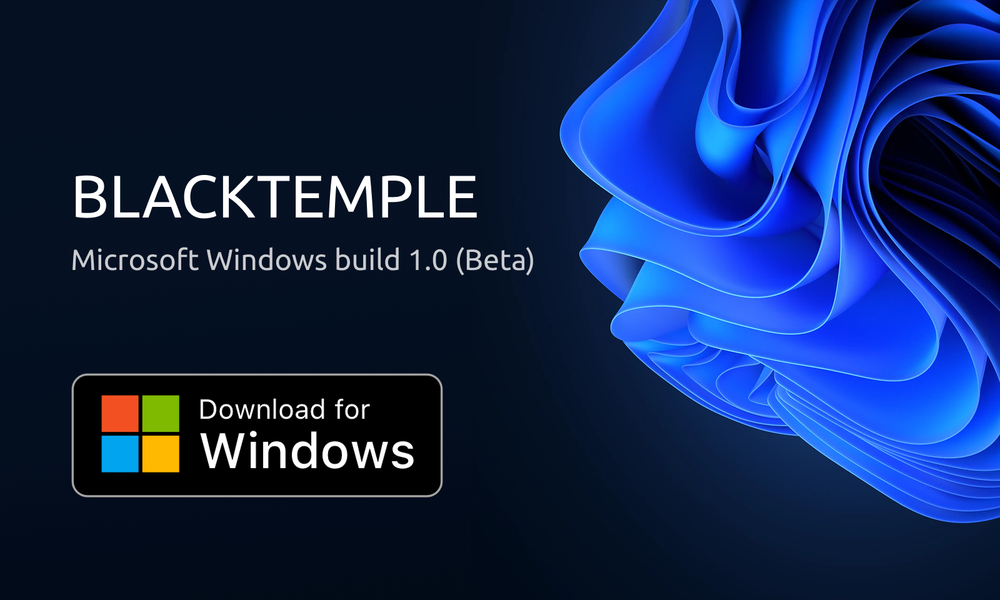

# 🏊 BLACKTEMPLE EXE for WINDOWS v1.0.0

)

Dear friends, colleagues, and lovely humans — we appreciate and value each of you!

We are excited to present the **first public release** of our long-awaited app. Today marks the start of an **open beta test** for Android devices. This is still a **beta version**, and we need **your feedback**. 

Tell us what works, what doesn’t, and what features you’d love to see. Your detailed reviews and suggestions will directly influence future updates and innovations.

---

## 🔧 Core Features

- 😄 **VLESS protocol support**  
- 📱 **Per-app tunneling**  
  *(Only selected apps will use the VPN; others will remain unaffected)*

---

## 🚫 Planned Features (Coming Soon)

- ❌ **AWG protocol support**
  *Amnezia Wireguard protocol*

- ❌ **BlackKeyDemon**  
  *Automatic key rotation and seamless reconnection — no user interaction required*

- ❌ **Ad.ban**  
  *Built-in ad blocker*

- ❌ **ThunderGaming**  
  *Reduced latency for gaming — finds optimal servers and routes*

- ❌ **SaveBlack**  
  *Battery saver mode — automatic disconnection based on schedule*

---

> 🧪 Please test, explore, and give us your honest impressions. Your support helps shape the future of BlackTemple!
